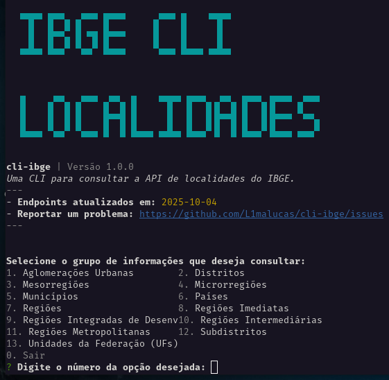

# CLI IBGE de Localidades

 <!-- Substitua pelo caminho real da sua logo, se houver -->

Uma interface de linha de comando (CLI) interativa e amigável para consultar a API de Localidades do Instituto Brasileiro de Geografia e Estatística (IBGE). Desenvolvida com foco em experiência do usuário, esta ferramenta permite navegar pelos diversos endpoints da API de forma intuitiva, sem a necessidade de memorizar IDs ou URLs complexas.

## Objetivo

Facilitar o acesso aos dados geográficos e estatísticos do IBGE através de uma interface de terminal colorida e interativa. A CLI abstrai a complexidade das requisições HTTP e do gerenciamento de IDs, permitindo que o usuário se concentre na obtenção das informações desejadas.

## Funcionalidades

-   **Navegação por Menus:** Menu principal em formato de colunas numeradas para seleção de módulos (grupos de endpoints).
-   **Autocomplete Inteligente:** Seleção de endpoints e parâmetros com sugestões em tempo real, buscando dados da própria API para preencher as opções (ex: selecionar um estado pelo nome em vez de digitar seu ID).
-   **Feedback Visual:** Indicadores de carregamento (spinners) durante as operações assíncronas (chamadas à API, salvamento de arquivos).
-   **Salvamento de Resultados:** Opção de salvar o retorno de qualquer consulta em um arquivo JSON local, com nome de arquivo gerado automaticamente e opção de escolher o diretório.
-   **Logs de Erro:** Serviço de log abstrato que registra detalhes de erros em um arquivo `logs/error.log` para facilitar a depuração e manutenção.
-   **Estrutura Modular:** Fácil adição e manutenção de novos endpoints através de arquivos de módulo TypeScript dedicados.

## Tecnologias Utilizadas

-   **Node.js:** Ambiente de execução JavaScript.
-   **TypeScript:** Linguagem de programação para tipagem estática e melhor organização do código.
-   **Inquirer.js:** Framework para criar interfaces de linha de comando interativas.
-   **Inquirer Autocomplete Prompt:** Plugin para `Inquirer.js` que adiciona funcionalidade de autocomplete.
-   **Axios:** Cliente HTTP baseado em Promises para fazer requisições à API do IBGE.
-   **Chalk:** Biblioteca para estilizar a saída do terminal com cores e estilos.
-   **Ora:** Biblioteca para exibir spinners de carregamento no terminal.

## Instalação

### Pré-requisitos

Certifique-se de ter o [Node.js](https://nodejs.org/) (versão 14 ou superior) e o [Yarn](https://yarnpkg.com/) instalados em sua máquina.

### Passos

1.  **Clone o repositório:**
    ```bash
    git clone https://github.com/L1malucas/cli-ibge.git
    cd cli-ibge
    ```

2.  **Instale as dependências:**
    ```bash
    yarn install
    ```

3.  **Compile o projeto:**
    ```bash
    yarn build
    ```

4.  **Torne a CLI executável globalmente (opcional):**
    ```bash
    yarn link
    # Agora você pode executar a CLI de qualquer lugar usando 'ibge-cli'
    ```
    Ou, para executar diretamente do diretório do projeto:
    ```bash
    yarn dev
    ```

## Como Usar

Para iniciar a CLI, você tem algumas opções:

```bash
# Se você instalou globalmente com 'yarn link'
ibge-cli

# Se você deseja executar diretamente do diretório do projeto
yarn dev

# Se o pacote estiver publicado no npm, você pode usar npx
npx ibge-cli
```

### Navegação na CLI

1.  **Menu Principal:** Ao iniciar, você verá uma lista numerada dos grupos de informações disponíveis (ex: Aglomerações Urbanas, Distritos, Países). Digite o número correspondente à sua escolha e pressione `Enter`.
    *   Para sair da aplicação a qualquer momento, digite `0`.

2.  **Seleção de Endpoint:** Após escolher um grupo, um novo menu interativo aparecerá com os serviços específicos (endpoints) disponíveis. Comece a digitar para filtrar as opções e use as setas para selecionar. Pressione `Enter` para confirmar.

3.  **Coleta de Parâmetros:** Se o serviço selecionado precisar de informações adicionais (parâmetros, como o ID de um estado ou o nome de um município):
    *   **Seleção por Autocomplete:** Para parâmetros que podem ser escolhidos de uma lista (ex: um estado, um município), a CLI buscará as opções e apresentará um campo de autocomplete. Comece a digitar o nome e selecione a opção desejada.
    *   **Entrada Manual:** Para outros parâmetros, será solicitado que você digite o valor diretamente.

4.  **Execução e Salvamento:** Depois de fornecer todas as informações, a CLI fará a consulta à API. Um indicador de carregamento será exibido. Se a consulta for bem-sucedida, você terá a opção de salvar o resultado em um arquivo JSON. Será perguntado onde você quer salvar (deixe em branco para o diretório atual).

## Estrutura do Projeto e Mapeamento da API

Esta CLI é construída de forma modular. A definição de cada grupo de serviços da API (seus endpoints, parâmetros e como buscar opções para autocomplete) reside em arquivos TypeScript separados dentro de `src/modules/`.

-   `src/modules/`: Contém um arquivo `.ts` para cada grupo de serviços da API (ex: `paises.ts`, `distritos.ts`).
-   `src/modules/index.ts`: Agrega todos os módulos em um único array `allModules` que é usado pela aplicação.
-   `src/types/api.ts`: Define as interfaces TypeScript para a estrutura dos módulos, endpoints e parâmetros.

### Como Adicionar ou Modificar Endpoints

Para adicionar um novo serviço ou modificar um existente, você deve editar o arquivo `.ts` correspondente em `src/modules/`. A estrutura de um módulo é a seguinte:

```typescript
// Exemplo de estrutura de um módulo
import { ApiModule } from '../types/api';

export const meuNovoModulo: ApiModule = {
  name: "Meu Novo Módulo",
  endpoints: [
    {
      summary: "Descrição curta do serviço para o menu",
      description: "Descrição detalhada do que este serviço faz.",
      method: "GET", // Ou POST, PUT, DELETE se a API suportar e a CLI for estendida
      path: "/caminho/da/api/{parametro}",
      parameters: [
        {
          name: "parametro",
          in: "path", // ou 'query'
          description: "Descrição do parâmetro para o prompt",
          required: true,
          source: { // Opcional: para prompts de autocomplete
            endpoint: "/caminho/para/buscar/opcoes",
            valueField: "id", // Campo do objeto retornado que será o valor do parâmetro
            displayField: "nome" // Campo do objeto retornado que será exibido ao usuário
          }
        }
      ]
    }
  ]
};
```

## Reportando Problemas e Contribuições

Encontrou um problema, um serviço desatualizado ou gostaria de sugerir uma nova funcionalidade?

Por favor, abra uma issue no repositório do projeto:

[**Abrir uma Issue no GitHub**](https://github.com/L1malucas/cli-ibge/issues)

Ao abrir uma issue, forneça o máximo de detalhes possível, incluindo:
-   Passos para reproduzir o problema.
-   Comportamento esperado vs. comportamento observado.
-   Mensagens de erro completas (incluindo stack trace, se aplicável).
-   Contexto da sua consulta (grupo, serviço, parâmetros).

Sua contribuição é muito bem-vinda!

## Licença

Este projeto está licenciado sob a licença MIT. Veja o arquivo [LICENSE](LICENSE) para mais detalhes.